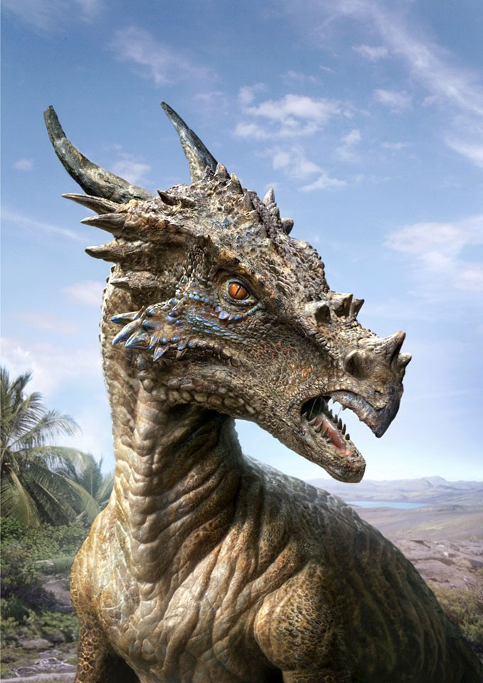

# Prehistoric-planet

 

     
    
Discover one Million years of Animal History

    

      

<h1>JURASSIC-AGE</h1>
 
    

   
 <h1>FLYING-ANIMALS</h1>
  
  

  
  <h1>MARINE-ANIMALS</h1>
  <a href="https://yashchitroda.github.io/Prehistoric-planet/category/marine%20animals.html"  style="color: black;">
  
  

<h1>LAND-ANIMALS</h1>
<a href="https://yashchitroda.github.io/Prehistoric-planet/category/animals.html"  style="color: black;">
  
  

